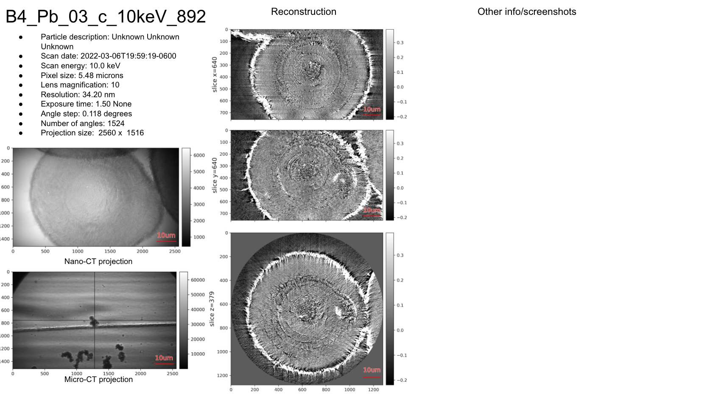

===========
tomolog-cli
===========

**tomolog-cli** is a command-line-interface for publishing tomography experiment data and meta data in a stack of Google slides

.. toctree::
   :hidden:
   :maxdepth: 1

   source/install
   source/usage
   source/api
   source/credits
