============
Installation
============

First, you must have `Conda <https://docs.conda.io/en/latest/miniconda.html>`_
installed and create a dedicated conda environment::

    (base)$ conda create -n tomolog python=3.9

and::

    (base)$ conda activate tomolog
    (tomolog)$ 

then install all `requirements <https://github.com/xray-imaging/mosaic/blob/main/requirements.txt>`_ with::

    (tomolog)$ conda install  -c conda-forge python=3.9 dropbox google-api-python-client matplotlib dxchange dxfile python-dotenv matplotlib-scalebar

install meta 
::

    (tomolog)$ git clone https://github.com/xray-imaging/meta.git
    (tomolog)$ cd meta
    (tomolog)$ python setup.py install

and install tomolog
::

    (tomolog)$ git clone https://github.com/xray-imaging/tomolog-cli.git
    (tomolog)$ cd tomolog
    (tomolog)$ python setup.py install

Requirements
============

Please install all the packages listed in `requirements file <https://github.com/xray-imaging/tomolog-cli/blob/main/envs/requirements.txt>`_. 

**tomolog** also requires access tokens from dropbox and google services.

Dropbox
-------

Go to `dropbox developer site <https://www.dropbox.com/lp/developers>`_ , login using your google credentials and select "Create an App":

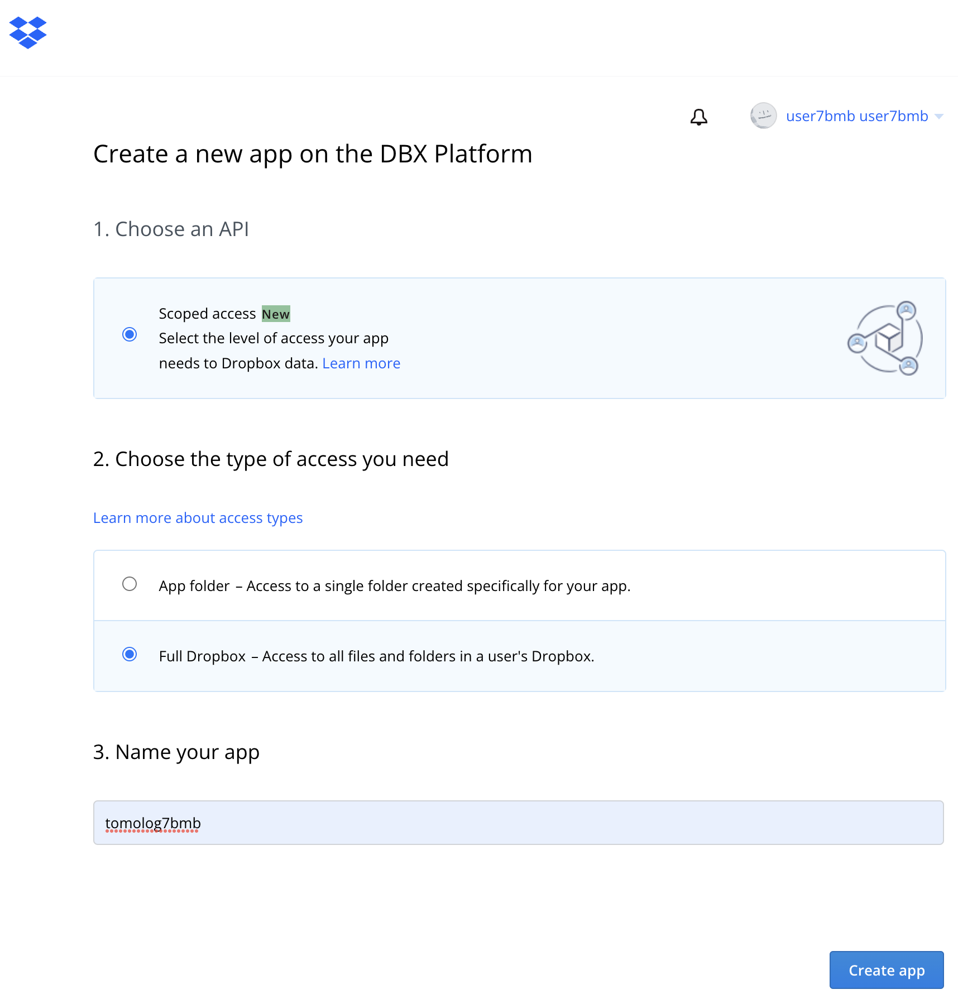

Take the App key and App secret from the Settings tab:

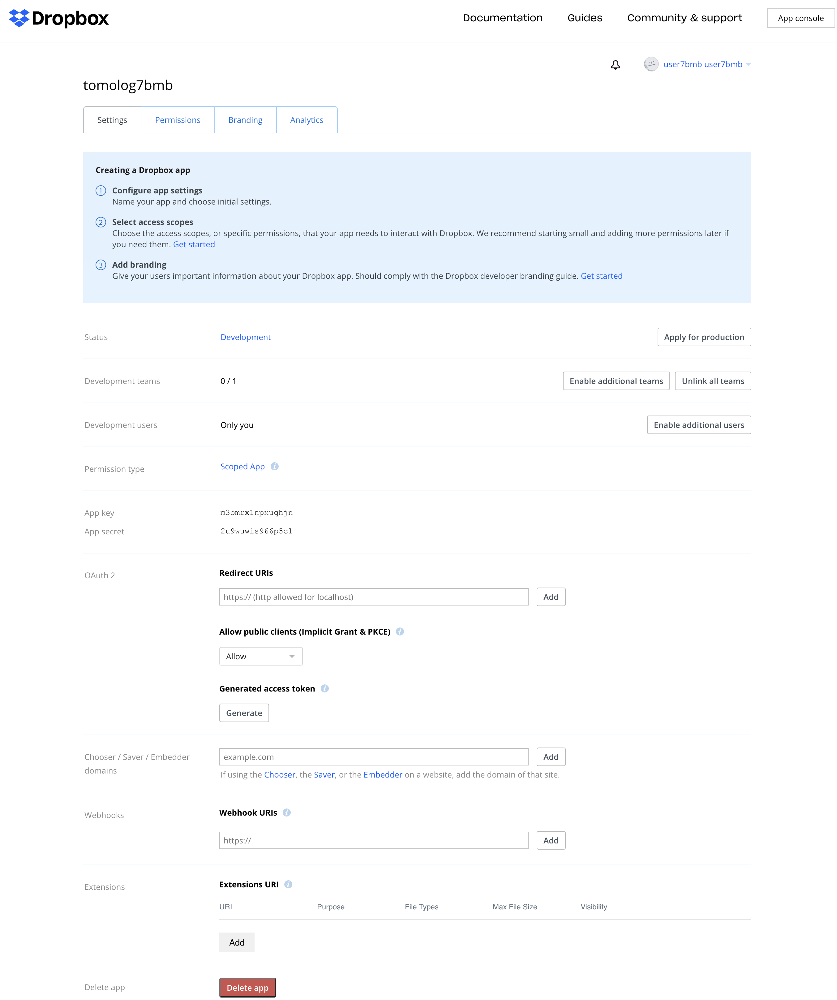

an copy them in a file in your home directory called:

::

    $ ~/.tomologenv 

    APP_KEY=....
    APP_SECRET=....

Set the following permissions:

Google
------

Next step is to authorize tomolog to create slides on the ...@gmail.com gmail account.

Open a web browser and login as ...@gmail.com then go to `google developer site <https://console.cloud.google.com/>`_ and press "Select a project" to create a new project

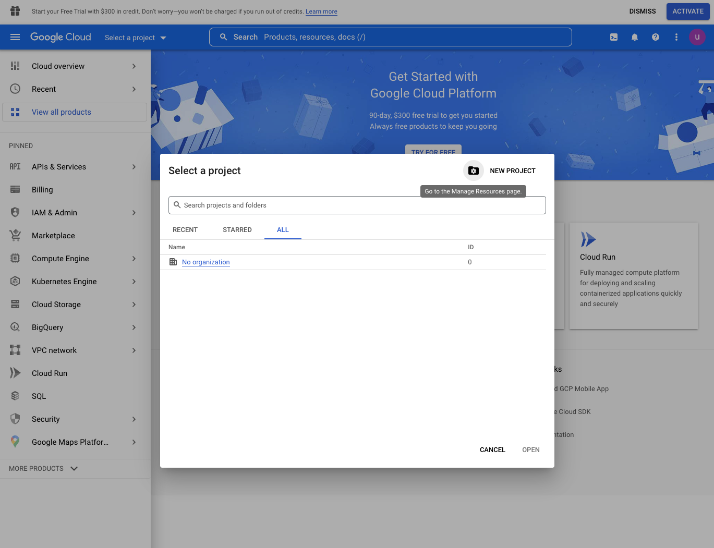

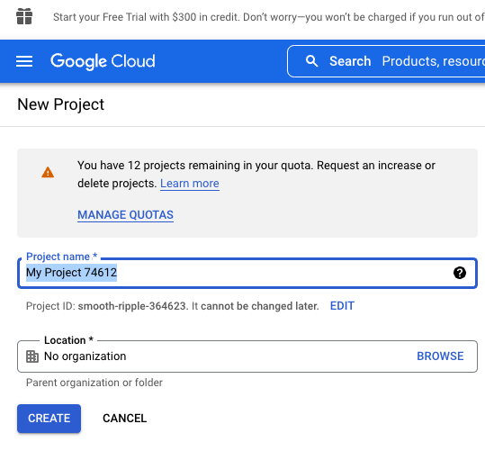

Once the project is selected go to the project dashboard:

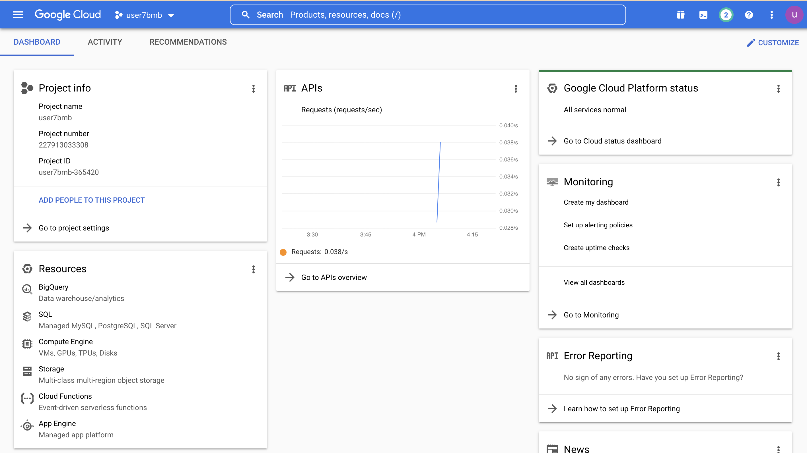

and select API & Services / Credentials

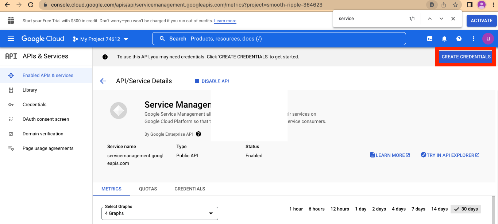

select it and then go to Create Credentials / Service account

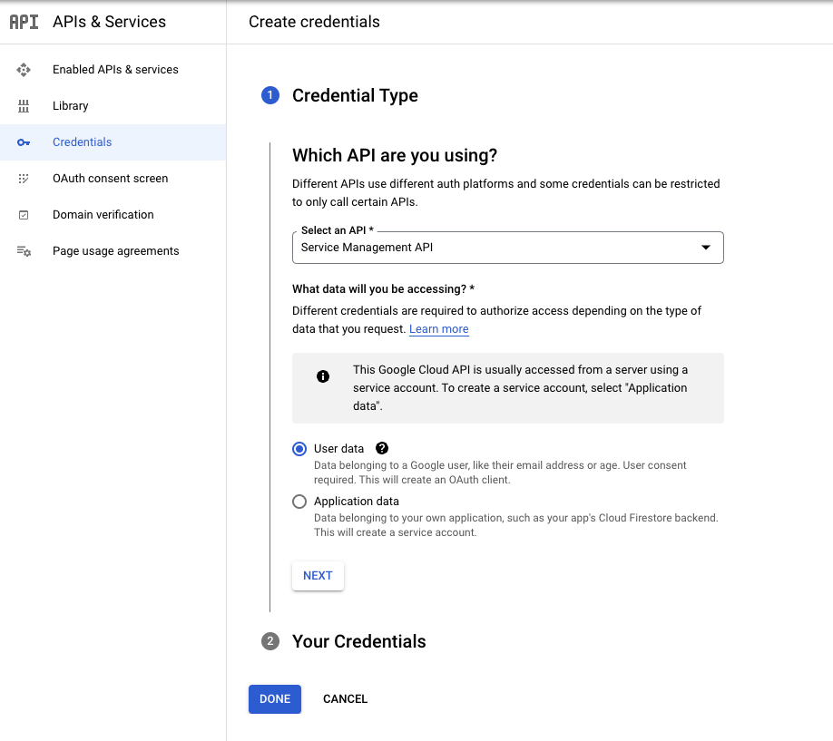

where you enter the service account name, i.e. tomolog

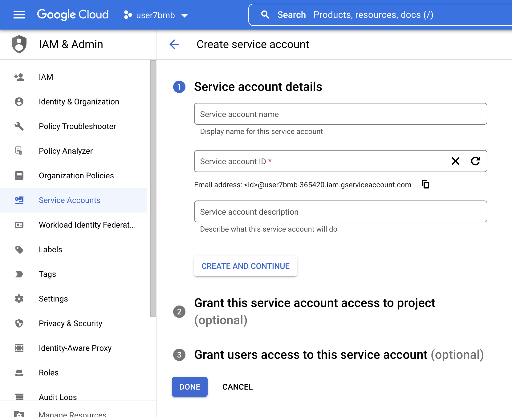

Grant this service account access to project: Owner

Grant users access to this service account:: 
   
   service account user role: Google Account email: ....@gmail.com
   service account admin role: Google Account email: ....@gmail.com

Once the service account is selected you need to create the authorization key:

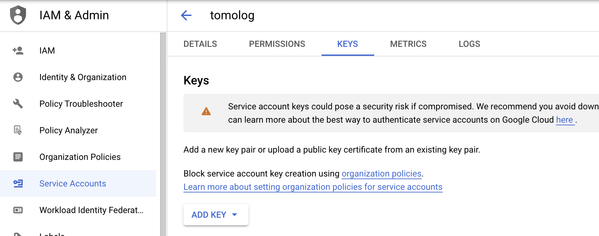

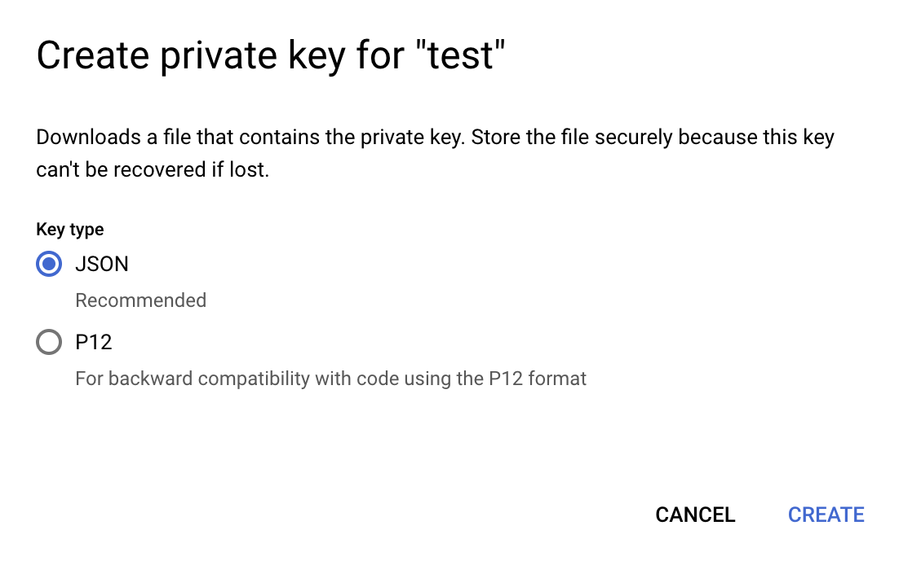

open the json file and copy the authorization token in a file called::

    $ ~/tokens/google_token.json

Go back to the project dashboard

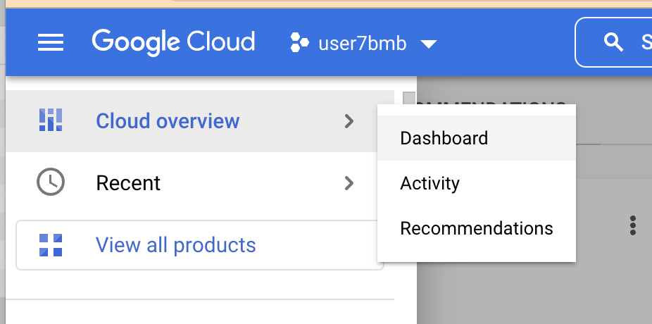

and select "Go to the API overview"

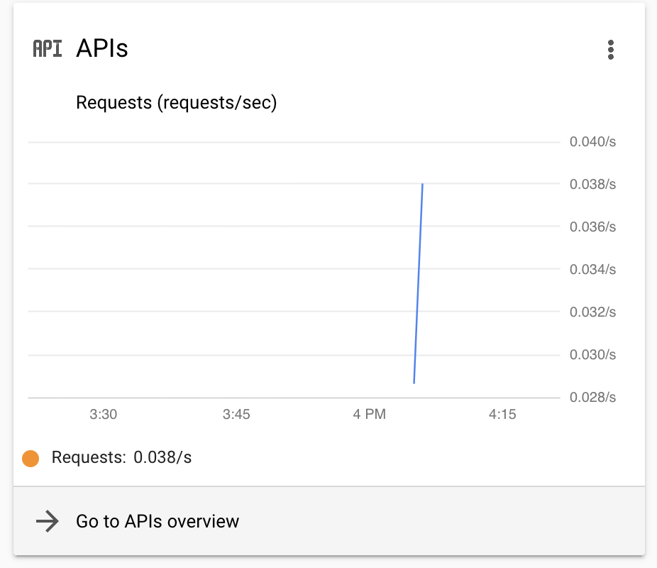

and select "Enable API and Services"

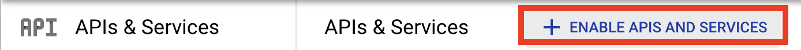

search and add the "google slide api"

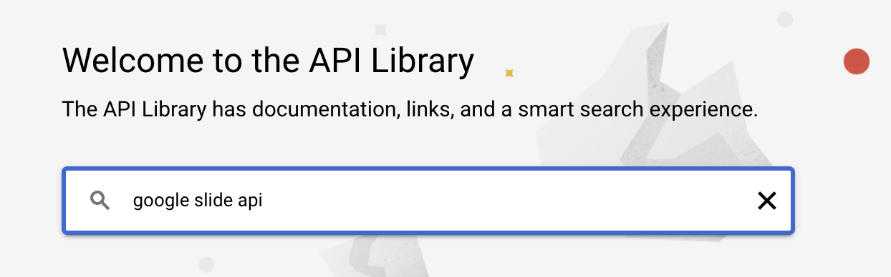

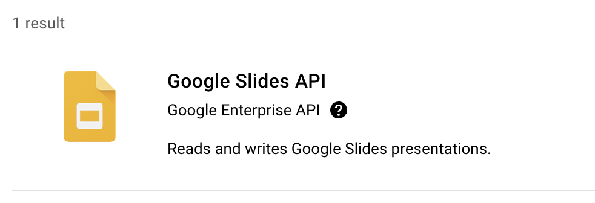

Now tomolog will be able to create slides in the ...@gmail.com user account.

